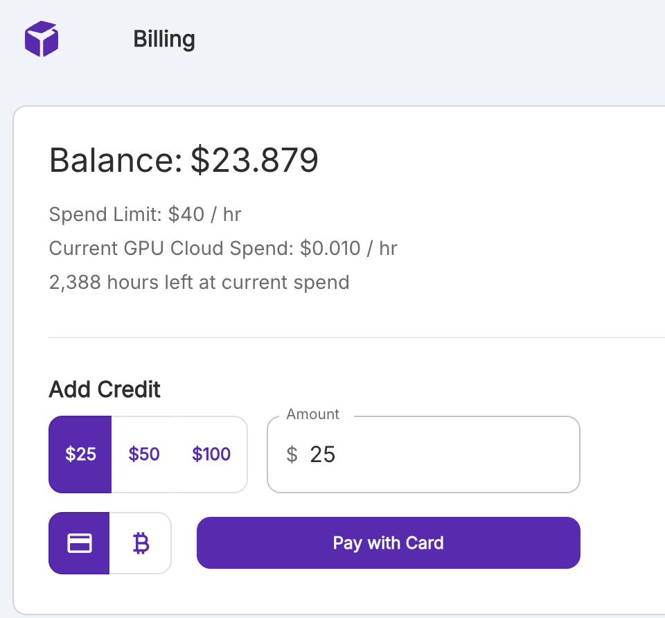
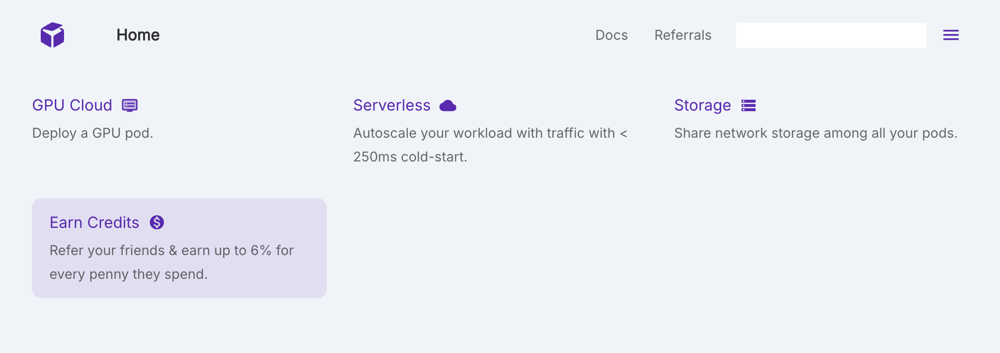
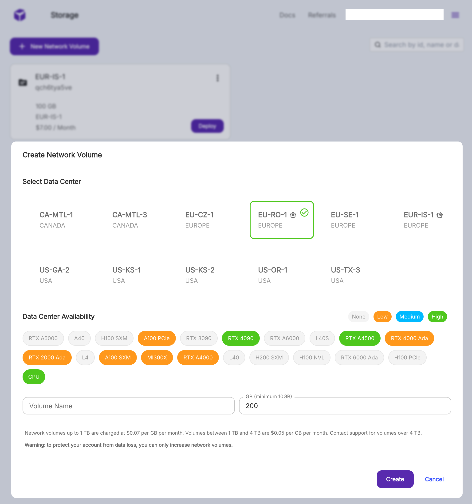
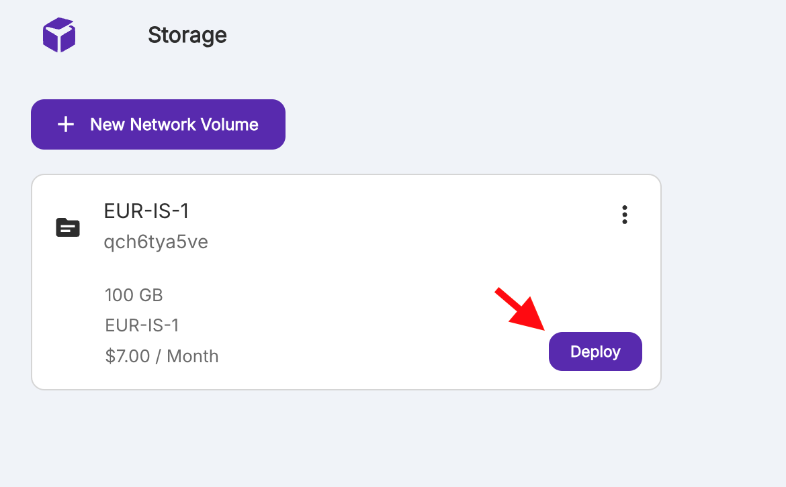
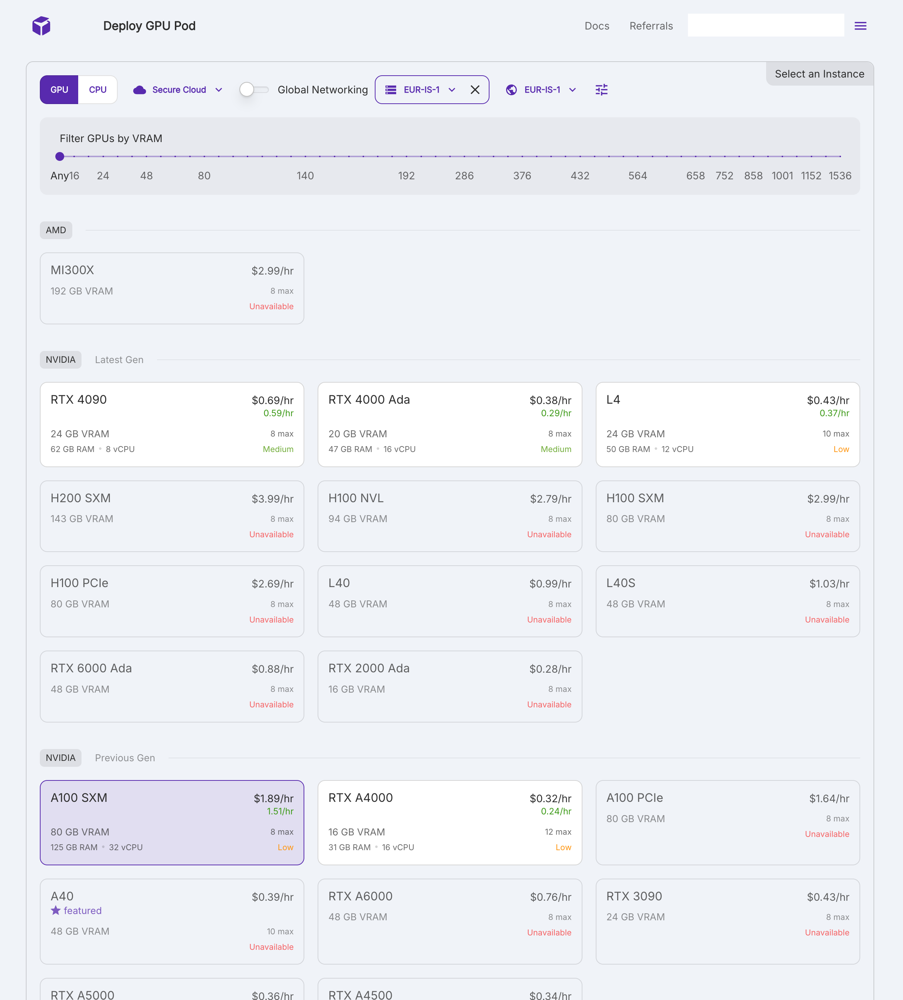
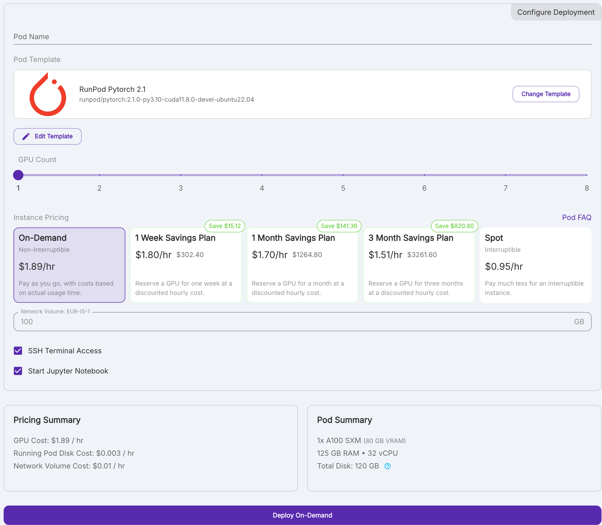
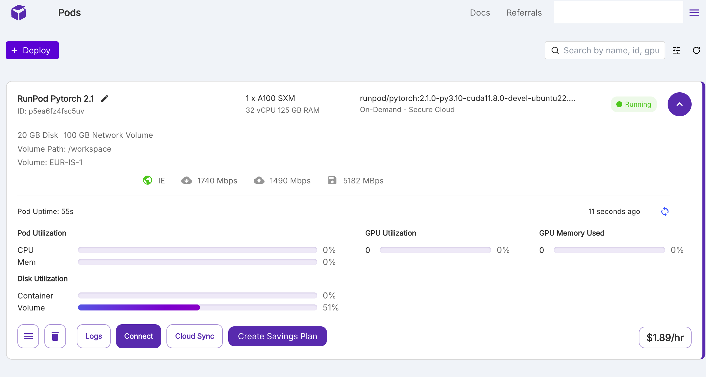

## ドラフト


- Kaggleにおける計算リソースの必要性
- Runpodとは
- なぜRunpodを使うのか
- Storageから始めよう
- GPU Cloudで計算環境をデプロイしてみよう
- 環境構築のtips
    - 環境のセットアップ
    - VSCodeのリモート開発
    - Secretsの活用
- 実用例 by エチレンさん
- まとめ
---


貸せ、RunpodはKaggleでこう使う
---
### はじめに: Kaggleにおける計算リソースの重要性
Kaggleでは、データサイエンスのコンペティションが開催されており、その多くはGPUを使った計算が必要だ。
例えば、画像認識のコンペティションでは、画像データを学習するために、大量の画像データをGPUで学習する必要がある。
これらの計算は、ローカルのPCでは難しいため、クラウド上の計算リソースを利用することが一般的だ。

そして、Kaggleのコンペティションにおいては、計算リソースの性能が勝敗を分けること多くある。
ぶっちゃけ私のようなセンスのない人間でも、多くの計算リソースを確保し、試行回数をとにかく増やせば、上位に入る確率が高まるのである。
(競プロや数学オリンピックではこうは行かない。資本主義バンザイ。)

計算リソースとしては、AWSやGCPが有名だが、これらは料金が高い。私のような貧民がこれらを多用してしまったら、破産待ったなしである。(資本主義が憎い。) そんな需要を満たすかのように、昨今ではGPUを専門に安く提供するサービスも増えてきている。その中でもRunpodは、その中でも特に優れたサービスだと感じた。

本ブログでは、Kaggler向けに、Kaggleに特化したRunpodの使い方やそのTipsを紹介する。
さらに、特別ゲストとして、Kaggle Grandmasterであるエチレン( @ethylene_66 ) さんをご招待した。過去コンペでどのようにRunpodを使っていたか、実例を交えて語っていただく。


### Runpodの紹介: なぜRunpodを使うのか
Runpodは、オンデマンドでGPUマシンを利用できるクラウドプラットフォームのひとつだ。
AWSやGCPなどの大手クラウドと比べると、手軽な価格帯やアカウント作成〜マシン構築までの簡単さが大きな特徴である。クラウド経験が浅い方でも導入しやすい設計だと感じた。また、他のGPUクラウドと比べて、インターフェイスがわかりやすく、Secrets(マネージドな環境変数管理)などの最低限エンジニアリングに必要な機能が揃っているのが魅力だ。
要約してしまえば、価格が安く、使いやすい というのがRunpodを使う理由だ。

実際にどうやってKaggle向けにRunpodを使っていくのか、実際にGUIの操作を交えて説明していこう。
一緒に操作を進めていく方は、まず以下のリンクからRunpodに登録しておこう。https://runpod.io?ref=6x122dhk
私のリファラルリンクだが、本記事への投げ銭代わりにご登録いただけると嬉しい。

登録が完了したら、作業を進める前にクレジットをチャージしておこう。Runpodは前払い制のサービスである(クラウド破産を免れるのでありがたい限りである)。

多分$10からチャージできる。


### まずはStorageから始めよう
https://www.runpod.io/console/home にログインすると、GPU Cloud, Serverless, Storage の3つの


GPU Cloudは、GPUを使った計算環境をデプロイするための機能だ。Kaggleではこの機能をメインに使うことになるだろう。
Serverlessは、GPUを用いたサーバーレスアーキテクチャを構築するための機能だ。今回は使わない。
Storageは、計算環境から切り離された永続データを保存するための機能だ。

実は一番うまく活用するべきなのは、Storage機能である。理由はちょっと複雑なのであとで説明する。
色々と便利なので、まずはGPU Cloudを使う前に、Storageを作っておこう。

Homeから Storage -> New Netweork Storage をクリックすると、以下のような画面になる。


ここで、Storageをリージョンとサイズを選択して作成する。リージョンによって、使えるGPUの種類が異なるので作成する前には使いたいGPUが使えるリージョンなのかをチェックしておこう。
サイズは、あとからでも増量はできるので、最初は小さめでも問題ない。
設定が終わったら、CreateをクリックしてStorageを作成する。

この前準備をしておいたほうがよい理由は、次にGPU Cloudの紹介をする際にわかる。


### GPU Cloudで計算環境をデプロイしてみよう
さて、いよいよGPU Cloudを使って計算環境(Podと呼ばれる)をデプロイしてみよう。
先ほど作ったStorageの右下のDeployボタンをクリックしよう。


すると、GPUを選択したり、Template(要はDocker Image)を選択したりする画面が出てくる。今回はとりあえず、A100のGPUを選択して進めてみよう。


Pod Templateには`Runpod Pytorch 2.1`を選択した。Kaggleの推論環境とPythonのバージョン、及び、Cudaのバージョンが合っているためだ。



他にも

- GPUをいくつつけるか？
- 長期間の使用を約束する代わりに割引を適用するか？

といった設定項目があるが、各自設定してほしい。
経験上Spotはすぐに止まるので、私は基本的にOn-Demandを使用している。

設定が終わったら、DeployをクリックしてPodをデプロイしよう。

以下のような画面が出てきたら、Podのデプロイが完了だ。あとは、この環境上で、あなたのコードを動かすだけである。



この計算環境のライフサイクルは挙動が特別なので、それを説明しないといけない。

- デプロイされたPodを一時停止(処理状態をそのまま保存し、非課金状態に移行すること)することはできない。停止する場合には、ゴミ箱のアイコンを押すしかない。
- `/workspace`に保存されたデータは永続化される。つまり、それ以外のディレクタに保存したデータはPodを終了すると消える。
- `/workspace`には、Storageで作成したデータがマウントされている。(だからはじめにStorageを作る必要があったんですね)


この挙動は、Docker Containerと捉えれば素直な挙動である。が、機械学習との相性は悪い。
なぜならば、機械学習では、事前学習済みモデルを用いたり、学習データを用いる計算をすることが多い。さらには、使うライブラリも多く、ライブラリのインストールには時間がかかる物が多いからだ。
起動するたびに初期化されてしまう環境の中で、どのように効率的に機械学習環境をセットアップするかが重要になる。そのためのTipsを、次の章で説明していこう。


補足:
- Storageを使わなくても、GPU CloudでPodをデプロイすることはできる。その場合、Podを停止することもできる。しかし、Podの実体のマシーンが他人に使われているときに、Podを再開することができない。これでは使いたいときに使えないし、停止中のPod内にあるデータを退避させることもできない。だからStorageを使う必要があったんですね。
- Templateを選択したあと、Edit Templateを押すと、portの設定や、環境変数の設定もできる。もし学習ログの可視化にtensorboardを使いたい場合には、対応する番号のportを開けておくとよいだろう。環境変数に関してはSecrets機能と深く関係するので、次の章で説明する。


### Kaggle向け環境構築のTips
Runpodを使って、Kaggle向けの計算環境を構築する際のTipsをQA形式で紹介する。

#### Q: 作業場所はどこにするべきか？
A: `/workspace`の配下にkaggleコンペ用のリポジトリを配置するのをおすすめする。データやモデル等もすべてこの配下に保存することで、Podを再起動してもデータが消えないようにする。


#### Q: Python環境は？ライブラリのインストールに時間がかかるんだけど
A: Kaggleコンペ用のリポジトリにPoetry環境を作成する。Poetryではリポジトリ直下の`.venv/`にライブラリをインストールするので、Podを再起動してもライブラリのインストールが不要になる。
なお、リポジトリ直下に`.venv/`を作成するためには、Poetryの設定ファイル`pyproject.toml`に以下の設定を追加する必要がある。

```toml
[tool.poetry]
virtualenvs-in-project = true
```


#### Q: VSCodeでリモート開発するには？
A. これを見ろ。https://docs.runpod.io/tutorials/pods/connect-to-vscode 
これも見ろ。 https://blog.runpod.io/how-to-connect-vscode-to-runpod/


#### Q: shellの環境が毎回初期化されるのが不便だ。どうすればいい？
A: 環境setup用のshell sriptを作成しましょう。こればかりはどうしようもなかった。
例えば、私は以下のようなスクリプトを用いている。Podが起動したら初手でこれを実行している。

```sh
apt update
apt upgrade -y
apt install -y fish tmux htop
pip install poetry kaggle

mkdir ~/.kaggle
echo $RUNPOD_SECRET_kaggle_json > ~/.kaggle/kaggle.json
# パーミッションを設定
chmod 600 ~/.kaggle/kaggle.json

git config --global user.email "{githubのメアド}"
git config --global user.name "{githubのユーザ名}"
```

`$RUNPOD_SECRET_kaggle_json`は、RunpodのSecrets機能を使って、Kaggle APIのトークンを設定している。
認証情報系は、Secrets機能を使って管理とセキュアに環境変数に受け渡す事ができて、setup用のscriptを構築できるのでおすすめである。


Podを作るときに環境変数のところでこんな感じに書いている。


#### Q: 学習したモデルを保存してたらディスク容量が大きくなり、費用が嵩んできた。どうすればいい？
A: 学習に毎回使わないものに関しては、Google Cloud Storageにuploadする。とても安い。


### 実用例 by エチレンさん
(プルリクください)


### まとめ
あとで書きます


あと、私のリファラルリンクをおいておきます。この記事が役立ったら、ぜひ投げ銭代わりに、ここから登録してください。
https://runpod.io?ref=6x122dhk


