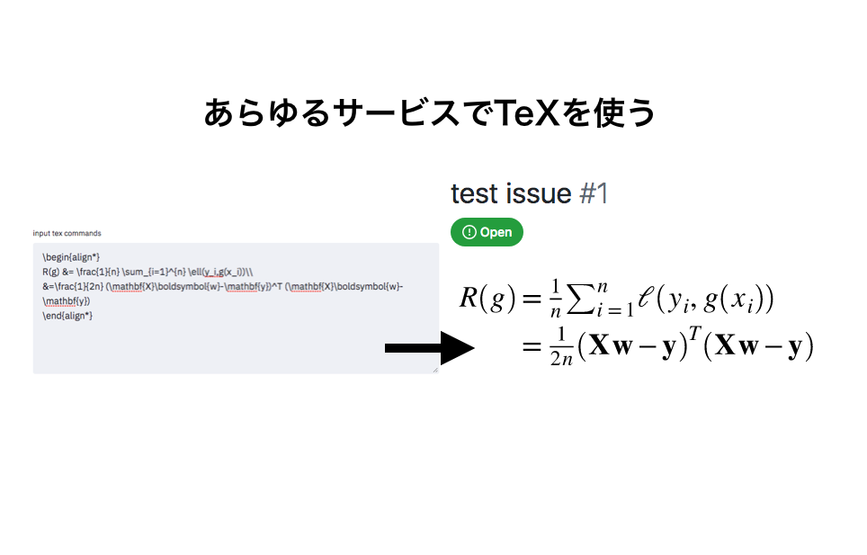
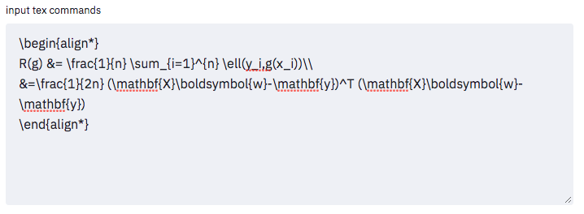
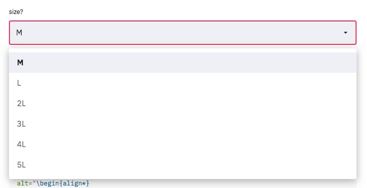

githubやnoteでもTeXの数式を書くぜ
===



### この記事は何？

これを作った

https://tex-image-link-generator.herokuapp.com/


これを使えば、githubのreadmeやissuesに数式を埋め込むことができる。

例えばこんなふうに。


noteやhatenablogなどのmarkdown(HTML)が使えるサービスに転用することもできるはず。


### 作成のモチベーション

githubに数式を埋め込む方法をかえるるるさんに教えていただいたのがきっかけ
https://twitter.com/kaeru_nantoka/status/1288266193829163008?s=20

しかし、``に直接数式を打っていくのは個人的に苦痛だった。


短い数式ならまだしも、長い数式になると視認性が低くなるからだ。さらに致命的なのが`+`を`%2B`に置き換えなければ行けない点だ(これはURL中の`+`が空白を意味することに原因がある)。

さらには後述する関連ツールがどれも自分の要望を満たさなかったために自分でつくろうとなった。

### 関連するツール

この方法を発見した人(?)が開発したツール。しかし現時点(2020/08/09)では、アクセスできずどのようなものだったかはわからない。
https://alexanderrodin.com/github-latex-markdown


自分がやっていることの上位互換であり、自分の要望をほぼ満たしている。しかし解像度が荒くてぼやけるという1点において満足行かなかった。
https://www.codecogs.com/latex/eqneditor.php


ここまで来たらwebアプリにしない？？あと、オリジナルの数式の情報を``タグに残してほしかった (あとで編集するときに必要な情報でしょ？)
https://jsfiddle.net/8ndx694g/


地味に便利そうなVSCode拡張。VSCodeをいつでも使うとは限らないのでwebアプリにしてほしかった。
https://marketplace.visualstudio.com/items?itemName=MeowTeam.vscode-math-to-image


ページ内のTeX表記を検知して数式に変換してくれるChrome拡張。良さげだけど共有するすべての人がこれをインストールしてるわけではないので...
https://ezoeryou.github.io/blog/article/2017-04-26-mathjax-load.html

### 使い方



言うまでもないですが、上部のtext areaに数式を打ち込んでctrl enter (or ⌘ enter)を押すだけ。



sizeは**previewのサイズではなく** 実際に表示されるサイズになってる(previewには反映される)。


resultの右側に`copy to clipboard`ボタンがあるのでそれをポチッとするのが早いでしょう。
得られたリンクをここに貼ってみる。


これにて表示完了。上記の画像は以下のような記述になっている。

```

```

数式の本体自体は`alt`属性に格納されているため、あとで編集することになってもURLを読解する必要はないだろう。


### まとめ

これを作った
https://tex-image-link-generator.herokuapp.com/

これで、noteやgithubにテキストベースで数式をかける用になった。個人的にはhatenablogの意味わからんtex記法からおさらばできるのが嬉しい。

開発はこっちでおこなっています。
https://github.com/masakiaota/tex_image_link_generator

### 参考

https://gist.github.com/a-rodin/fef3f543412d6e1ec5b6cf55bf197d7b
